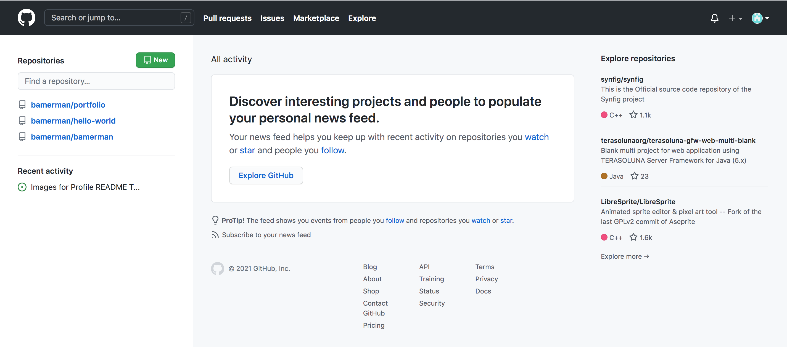

# GitHub UI reference guide
The GitHub UI makes it easy to manage and discover open-source code. Here, you'll find descriptions of the main features of the GitHub UI and how to use them. 

[Home page](#home-page) 
&nbsp; &nbsp; &nbsp; [Navigate](#navigate) 
&nbsp; &nbsp; &nbsp; [Manage](#manage) 
&nbsp; &nbsp; &nbsp; [Discover](#discover) 
Repositories 
&nbsp; &nbsp; &nbsp; Issues 
&nbsp; &nbsp; &nbsp; Pull requests 
&nbsp; &nbsp; &nbsp; Actions 
&nbsp; &nbsp; &nbsp; Projects 
&nbsp; &nbsp; &nbsp; Wiki 
&nbsp; &nbsp; &nbsp; Security  
&nbsp; &nbsp; &nbsp; Insights  
&nbsp; &nbsp; &nbsp; Settings  
    
## Home page
The [GitHub home page](https://github.com/) contains all the UI features you'll need to do the following:
- Navigate GitHub 
- Manage code 
- Discover projects

<a name="navigate">**Navigate**</a>

<a name="manage">**Manage**</a>

<a name="discover">**Discover**</a>

